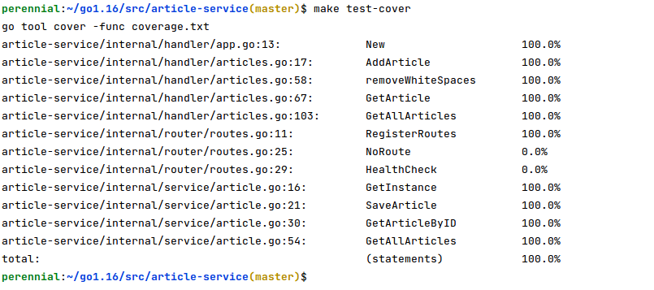

# article service
Simple go application to demonstrate REST API for article app

## Prerequisites
1. docker 
2. mockery to mock interface functions github.com/vektra/mockery/v2

## Tools used
- [gin](https://github.com/gin-gonic/gin)
- [mockery](https://github.com/vektra/mockery)
- [sqlmock](https://github.com/DATA-DOG/go-sqlmock) to mock sql queries
- [validator](https://github.com/go-playground/validator)

## Setup process
### Running Application
To build and run application simply run
for linux
```shell
sh start.sh
```
for mac
```shell
bash start.sh
```

To stop application run
```shell
  docker-compose down
```  

To create mocks run
   ```shell 
    make gen-mock 
   ```
To run unit test run 
   ```shell 
    make unit-test 
   ```

To check the coverage run
```shell
 make test-cover
```

### Env
To specify custom environment variables make use of `.env` file
```shell
DB_USERNAME="root"
DB_PASSWORD="pass"
DB_HOST="svc-database"
```
### Coverage:
